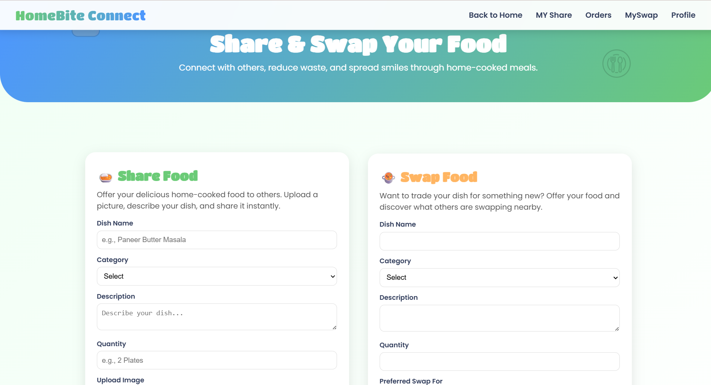
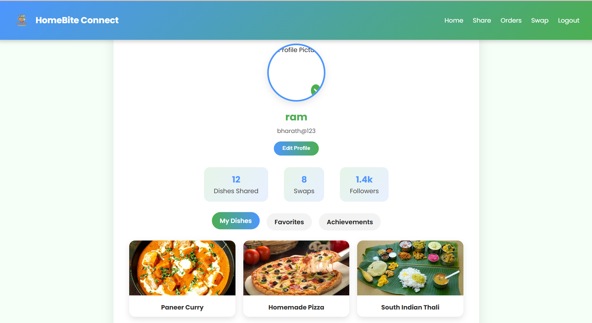

🍽️ HomeBite Connect

A community-driven web application to share, swap, and discover homemade dishes in local neighborhoods.
Connect with local food lovers, share your homemade specialties, and explore the taste of your community.

      

📖 Table of Contents

Overview

Features

Technology Stack

Installation and Setup

Usage

Screenshots

Contributing

License

Future Enhancements

Developed By

🏠 Overview

HomeBite Connect provides a platform for food enthusiasts to share homemade dishes, request swaps, and connect with their local neighborhood foodies.
It fosters community bonding through the joy of sharing food and cultural flavors.

## ✨ Features

| Feature | Description |
|----------|--------------|
| 👤 **User Authentication** | Secure registration and login with Spring Security |
| 🍛 **Dish Sharing** | Upload and manage dishes with images and details |
| 🔄 **Swap Requests** | Send, accept, or decline swap requests easily |
| 🧍‍♂️ **Profile Management** | Edit and manage your personal profile |
| ⚡ **Real-Time Experience** | Interactive and responsive user interface |
| 📱 **Mobile Responsive** | Works smoothly across all device sizes |
| 🤝 **Community Driven** | Encourages local sharing and interaction |

## 💻 Technology Stack

| Layer | Technologies |
|-------|---------------|
| **Backend** | Java, Spring Boot, Spring Security |
| **Frontend** | Thymeleaf, HTML, CSS, JavaScript |
| **Database** | MySQL / PostgreSQL with JPA (Hibernate) |
| **Image Handling** | Multipart file upload & static resources |
| **Build Tool** | Maven |

⚙️ Installation and Setup
Follow these steps to run the project locally:
# 1️⃣ Clone the repository
git clone https://github.com/USERNAME/homebite-connect.git
# 2️⃣ Navigate to the backend project folder
cd homebite-connect-backend
# 3️⃣ Build the project
./mvnw clean install
# 4️⃣ Run the application
./mvnw spring-boot:run
Now, open your browser and visit 👉 http://localhost:8080

🚀 Usage

Once the app is running:

Register a new user account

Login with your credentials

Share your dishes with photos and descriptions

Browse other dishes and send swap requests

Accept or reject incoming swap offers

Manage your profile and shared dishes

## 🖼️ Screenshots

### 🏡 Home Page  

### 🍲 Dish Sharing Page  

### 👤 Profile Page  

📜 License

This project is licensed under the MIT License.
You’re free to use, modify, and distribute this project with proper credit.

🌱 Future Enhancements

💬 In-app chat between users

📍 Location-based dish discovery

⭐ Dish rating & review system

📱 Dedicated mobile app version

🔔 Real-time notifications for swaps

👨‍💻 Developed By

Bharath Kumar
🎯 Passionate about creating smart, community-driven platforms that connect people through technology.

📧 [bharathkumarp0058@gmail.com] 
